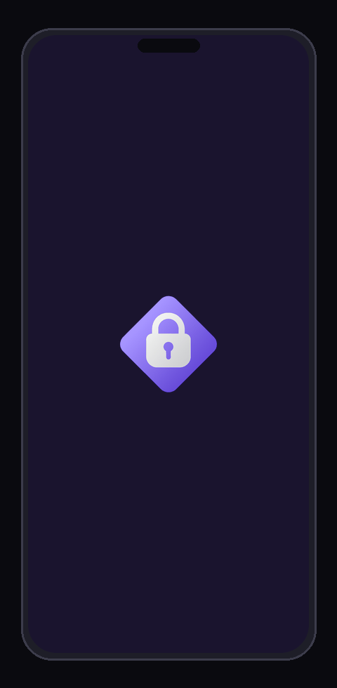

# 🔐 Zero Password Manager  
### Приватный • Self-Hosted • Менеджер паролей без облака на Flutter

<!--
Keywords: Менеджер паролей, Self-hosted, Zero-Knowledge, Приватность, Без облака, Flutter, FastAPI, AES-256-GCM, Argon2id, Cyberpunk UI, Glassmorphism, Open Source, Безопасность, 2FA, TOTP, Хранилище, Шифрование.
Description: Премиальный, приватный, self-hosted менеджер паролей с потрясающим интерфейсом в стиле Cyberpunk и Glassmorphism. Создан на Flutter и FastAPI. Никаких облаков, только ваши данные под вашим контролем.
-->

**Zero Password Manager** — это **приватно-ориентированный менеджер паролей**, созданный на **Flutter**, который дает вам **полный контроль над вашими конфиденциальными данными**.

В отличие от традиционных менеджеров паролей, **Zero Password Manager НЕ использует облачные хранилища**.  
Ваши пароли и сид-фразы хранятся **только на вашем собственном сервере**, обеспечивая **максимальную приватность, безопасность и полное владение данными**.

Никакого доступа третьих лиц.  
Никаких облачных провайдеров.  
Никакой слежки.

Только **вы и ваши данные**.

---

## 🎬 Демо — Превью интерфейса Flutter



> **Процесс (Flutter app):**
> Splash → Login → Sign Up → 2FA Setup → Ввод PIN → Хранилище паролей → Добавление → Настройки
> + Показ тем: **Midnight Dark** · **Cyberpunk** (neon cyan/magenta) · **Glassmorphism** (blur glass cards)

---

# 🚀 Ключевые особенности

## ☁️ Никакого облака. Совсем.
Большинство менеджеров паролей хранят ваши данные в **сторонней облачной инфраструктуре**.

**Zero Password Manager — нет.**

✔ Ваши данные остаются **только на вашем сервере**  
✔ Нет Google Cloud  
✔ Нет AWS  
✔ Нет внешних серверов  
✔ Никакого сбора данных  

Это гарантирует **настоящую собственность и приватность данных**.

---

## 🔑 Безопасное хранилище паролей
Надежно храните и управляйте:
- логинами сайтов
- API-ключами
- приватными учетными данными
- личными секретами

Все данные хранятся в **защищенном зашифрованном хранилище** с использованием **AES-256-GCM**. Мастер-пароль никогда не покидает ваше устройство (**Zero-Knowledge**).

---

## 📁 Папки паролей
Организуйте пароли в **папки** для удобной навигации и управления:
- Создавайте папки с **именем, цветом** (12 вариантов цвета) **и иконкой** (16 иконок на выбор)
- **Горизонтальная панель папок** на главном экране позволяет фильтровать пароли по папке в один тап
- **Выбирайте папку** при добавлении или редактировании записи (необязательно)
- Откройте **экран управления папками** (кнопка «Управление» в панели папок) — создание, редактирование, переименование, изменение цвета и удаление
- Удаление папки **не удаляет пароли** — они просто становятся без папки
- Полная поддержка REST API: `GET /folders` · `POST /folders` · `PUT /folders/{id}` · `DELETE /folders/{id}`
- Папки привязаны к пользователю на сервере — **без утечки данных между аккаунтами**

---

## 🛡️ Усиленная 2FA
Встроенная поддержка TOTP (Google Authenticator, Microsoft Authenticator, Aegis и др.).
- Обязательная настройка 2FA при регистрации.
- OTP-подтверждение для критических операций.
- Защита от повторных атак (Replay attack protection).

---

## 🎨 Красивые кастомные темы
Zero Password Manager включает **3 уникальные темы интерфейса**:
- **Cyberpunk**: Футуристичный неоновый интерфейс.
- **Glassmorphism**: Современный стиль "матового стекла" с эффектами размытия.
- **Midnight Dark**: Глубокий темный интерфейс, оптимизированный для OLED-экранов и ночного использования.

---

# 📱 Сделано на Flutter
Приложение разработано на **Flutter**, что делает его быстрым и кроссплатформенным.
Поддерживаемые платформы: Android, iOS, Web, Desktop (Windows / macOS / Linux).

---

# 🛡 Философия безопасности
Zero Password Manager следует модели **Zero Cloud Security**.
Ваши секреты никогда не должны находиться в чужой инфраструктуре.
- Никаких внешних облачных сервисов.
- Никакой аналитики и трекинга.
- Никакого доступа третьих сторон.
- Всё остается **под вашим контролем**.

---

# ⚙️ Стек технологий
- **Flutter & Dart**
- **FastAPI & Python**
- **SQLAlchemy** (Локальная SQLite)
- **Argon2id & AES-256-GCM**

---

# 📦 Локальное развертывание (Облако не нужно)

Zero Password Manager предназначен для самостоятельного хостинга в вашей локальной сети.

## 🐍 1. Настройка бекенда (FastAPI)
Сервер обрабатывает аутентификацию, логи аудита и хранит зашифрованные данные.

1.  **Перейдите в директорию сервера**:
    ```bash
    cd server
    ```
2.  **Установите зависимости**:
    ```bash
    pip install -r requirements.txt
    ```
3.  **Настройте окружение**:
    Скопируйте `env.example` в `.env` и задайте свой `JWT_SECRET_KEY`.
4.  **Запустите сервер**:
    ```bash
    python -m uvicorn main:app --host 0.0.0.0 --port 3000
    ```
    *API будет доступно по адресу `http://localhost:3000`.*

---

## 📱 2. Настройка Flutter приложения
Убедитесь, что у вас установлен Flutter SDK.

1.  **Установите зависимости**:
    ```bash
    flutter pub get
    ```
2.  **Конфигурация**:
    Создайте файл `.env` в корневой директории (на основе `env.example`). Укажите `API_BASE_URL` на IP-адрес вашего сервера.
3.  **Запустите приложение**:
    ```bash
    flutter run
    ```

## 📦 3. Сборка для мобильных устройств (Android и iOS)

Чтобы собрать приложение для мобильных платформ:

#### Android
```bash
flutter build apk --release
# Или для выгрузки в Store
flutter build appbundle --release
```

#### iOS / Apple
*Примечание: Требуется macOS и установленный Xcode.*
```bash
flutter build ios --release
```

---

# 🤝 Участие в разработке
Я буду очень рад любой помощи в развитии проекта **Zero Password Manager**! 

Если вы хотите:
- 🛠 Исправить баги
- ✨ Добавить новые фичи
- 🎨 Улучшить дизайн (UI/UX)
- 📝 Улучшить документацию

Смело делайте **fork** репозитория, создавайте ветку и присылайте **Pull Request**. Любой вклад ценен!

---

# 📜 Лицензия
Этот проект лицензирован под **PolyForm Noncommercial License 1.0.0**.

✅ **Вы можете**: Использовать, изучать, изменять и распространять проект для личных, исследовательских или хобби-целей.
❌ **Вы не можете**: Использовать проект в коммерческих целях или любой деятельности, приносящей доход.

---

> 🔐 **Zero Password Manager** — Ваши данные, ваш сервер, ваши правила.

---
[English version of README](README.md)
